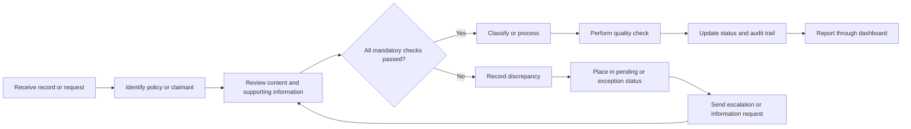
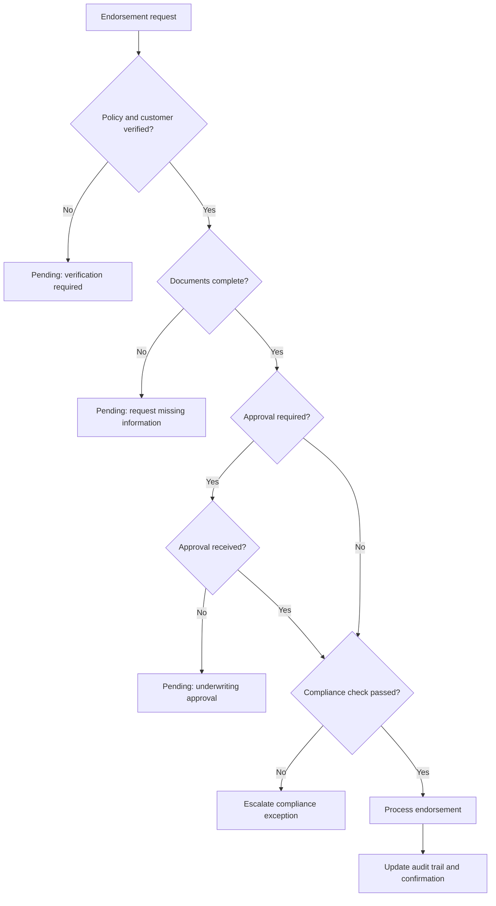

<div align="center">

# 🛡️ Insurance Operations Portfolio

### Claims Classification · Policy Endorsements · Quality & Compliance

[](#-tools--skills)
[](#-tools--skills)
[](#-tools--skills)
[](#%EF%B8%8F-important-disclaimer)

**A practical back-office insurance portfolio demonstrating record review, auto and home policy administration, data-quality controls, compliance checks, and operational reporting.**

[Explore the projects](#-portfolio-projects) · [View the workflow](#-end-to-end-workflow) · [Open the files](#-repository-structure) · [Interview guide](#-interview-talking-points)

</div>

---

## 📌 Portfolio Overview

This portfolio simulates the daily responsibilities of a **Back Office - Policy Administration** associate working with Property & Casualty insurance records. It demonstrates how incoming claimant documents and policy-change requests can be reviewed, validated, categorized, processed, monitored, and communicated using Microsoft Office.

| Portfolio metric | Included |
|---|:---:|
| Simulated claims records | **30** |
| Simulated endorsement requests | **30** |
| Complete Excel projects | **3** |
| Word SOPs and user guides | **3** |
| Outlook-compatible email samples | **3** |
| Real customer or insurer data | **No** |

> [!IMPORTANT]
> Every name, policy number, transaction, business rule, and outcome in this repository is fictional. The portfolio demonstrates process knowledge and Microsoft Office skills; it does not represent professional employment or actual insurer procedures.

---

## 🗂️ Portfolio Projects

### 1️⃣ Claims Document Classification

> Review incoming claimant records and segregate them into **Medical**, **Non-Medical**, and **Bill** categories.

| File | Purpose |
|---|---|
| [Claims Classification Project](Project_1_Claims_Classification/Claims_Classification_Project.xlsx) | Interactive claims register with 30 fictional records |
| [Claims Classification SOP](Project_1_Claims_Classification/Claims_Classification_SOP.docx) | Step-by-step record-review procedure |
| [Claims Exception Escalation](Project_1_Claims_Classification/Claims_Exception_Escalation.eml) | Outlook-compatible escalation email |

<details>
<summary><strong>What this project demonstrates</strong></summary>

- Reviewing document descriptions and determining business relevance
- Categorizing records as Medical, Non-Medical, or Bill
- Checking missing pages, duplicates, priority, and completeness
- Maintaining exception notes and a clear resolution action
- Applying quality-control checks before completion
- Using Excel tables, filters, validation lists, and conditional formatting

</details>

<details>
<summary><strong>Example decision</strong></summary>

```text
Document: Hospital discharge summary
Category: Medical
Completeness: No
Status: Exception
Action: Request the missing mandatory page before completion
```

</details>

---

### 2️⃣ Auto & Home Policy Endorsement Processing

> Process policy modifications only after verifying the policy, supporting information, approvals, effective dates, and compliance status.

| File | Purpose |
|---|---|
| [Endorsement Processing Project](Project_2_Endorsement_Processing/Endorsement_Processing_Project.xlsx) | Controlled auto and home endorsement register |
| [Endorsement Processing Checklist](Project_2_Endorsement_Processing/Endorsement_Processing_Checklist.docx) | Verification, decision, and audit-trail checklist |
| [Pending Information Email](Project_2_Endorsement_Processing/Endorsement_Pending_Information.eml) | Outlook-compatible request for missing information |

<details>
<summary><strong>Endorsement types covered</strong></summary>

- Address change
- Add vehicle
- Add driver
- Coverage increase
- Add nominee
- Mortgagee change
- Policy-detail correction

</details>

<details>
<summary><strong>Processing controls</strong></summary>

| Control | Decision question |
|---|---|
| Policy verification | Is the request linked to the correct active policy? |
| Document completeness | Is all required supporting information available? |
| Customer verification | Has the policyholder or agent been verified? |
| Approval | Has underwriting approval been received when required? |
| Compliance | Does the request pass the simplified compliance check? |
| Audit trail | Are the issue, decision, date, and action recorded? |

</details>

---

### 3️⃣ Insurance Operations Quality & Compliance Dashboard

> Convert operational records into clear workload, accuracy, turnaround, and compliance indicators.

| File | Purpose |
|---|---|
| [Quality & Compliance Dashboard](Project_3_Quality_Dashboard/Quality_Compliance_Dashboard.xlsx) | Formula-driven dashboard with charts and source data |
| [Dashboard User Guide](Project_3_Quality_Dashboard/Quality_Dashboard_User_Guide.docx) | KPI definitions and weekly review procedure |
| [Weekly Operations Status](Project_3_Quality_Dashboard/Weekly_Operations_Status.eml) | Outlook-compatible status email |

<details>
<summary><strong>Dashboard KPIs</strong></summary>

- Total records and requests
- Completed and pending volumes
- Claims exception count
- Quality-control pass rate
- Endorsement completion rate
- Requests completed within turnaround time
- Average turnaround time
- Compliance-review count
- Claims category mix

</details>

---

## 🔄 End-to-End Workflow



### Endorsement decision logic



---

## 🧰 Tools & Skills

| Area | Demonstrated capabilities |
|---|---|
| **Microsoft Excel** | Structured tables, formulas, validation lists, conditional formatting, filters, KPI calculations, and charts |
| **Microsoft Word** | SOP writing, operational checklists, process documentation, and user guidance |
| **Microsoft Outlook** | Exception escalation, missing-information requests, and weekly status communication |
| **Policy Administration** | Auto and home endorsements, coverage changes, effective dates, approvals, and audit trails |
| **Claims Operations** | Record review, classification, completeness checks, duplicate checks, and exception handling |
| **Quality & Compliance** | Data integrity, QC results, discrepancy resolution, compliance review, and turnaround monitoring |
| **Professional Skills** | Attention to detail, comprehension, written communication, prioritization, and guideline-based decisions |

---


## 📁 Repository Structure

```text
Insurance_Operations_Portfolio/
│
├── README.md
│
├── Project_1_Claims_Classification/
│   ├── Claims_Classification_Project.xlsx
│   ├── Claims_Classification_SOP.docx
│   └── Claims_Exception_Escalation.eml
│
├── Project_2_Endorsement_Processing/
│   ├── Endorsement_Processing_Project.xlsx
│   ├── Endorsement_Processing_Checklist.docx
│   └── Endorsement_Pending_Information.eml
│
└── Project_3_Quality_Dashboard/
    ├── Quality_Compliance_Dashboard.xlsx
    ├── Quality_Dashboard_User_Guide.docx
    └── Weekly_Operations_Status.eml
```

---

## 🚀 How to Use This Portfolio

1. Download or clone the repository.
2. Open each `.xlsx` file in Microsoft Excel.
3. Use filters to review completed, pending, and exception cases.
4. Change sample statuses or source values to see the workbook controls in action.
5. Read the related `.docx` file to understand the process and decision rules.
6. Open the `.eml` file in Outlook to review the corresponding communication.
7. Use the dashboard to explain how operational performance and quality are monitored.

> [!TIP]
> During an interview, open the Excel files in the same order as the projects above. Explain the business problem first, then the process, controls, exceptions, and outcome.

---

## 💬 Interview Talking Points

<details>
<summary><strong>How did you maintain data accuracy?</strong></summary>

I used controlled categories and statuses, mandatory-field checks, duplicate identification, exception notes, and a separate quality-control outcome before completing a record.

</details>

<details>
<summary><strong>What did you do when information was missing?</strong></summary>

I did not process the request based on assumptions. I recorded the exact discrepancy, changed the item to Pending or Exception, identified the required action, and prepared a professional follow-up email.

</details>

<details>
<summary><strong>How did you apply underwriting or compliance rules?</strong></summary>

The endorsement project uses simplified learning rules to determine required information, approval needs, and target turnaround time. A request is completed only after every mandatory control passes.

</details>

<details>
<summary><strong>How does the dashboard help operations?</strong></summary>

It converts source records into visible KPIs for completion, quality, pending workload, turnaround time, category mix, and compliance exceptions so that work can be prioritized and followed up.

</details>

---

## 🎯 Job Alignment

This portfolio is designed around entry-level responsibilities in:

- Back Office - Policy Administration
- Insurance Operations
- Auto and Home Policy Endorsements
- Claims Document Review
- Property & Casualty Insurance Support
- Data Quality and Compliance Operations

---

## ⚠️ Important Disclaimer

This repository is an independent educational simulation. It is not affiliated with an insurer, does not contain confidential information, and must not be interpreted as legal, underwriting, or regulatory guidance. Actual insurance processing must follow the applicable company procedures, underwriting rules, and jurisdiction-specific laws.

<div align="center">

### Built to demonstrate accuracy, process discipline, and clear communication.

</div>
